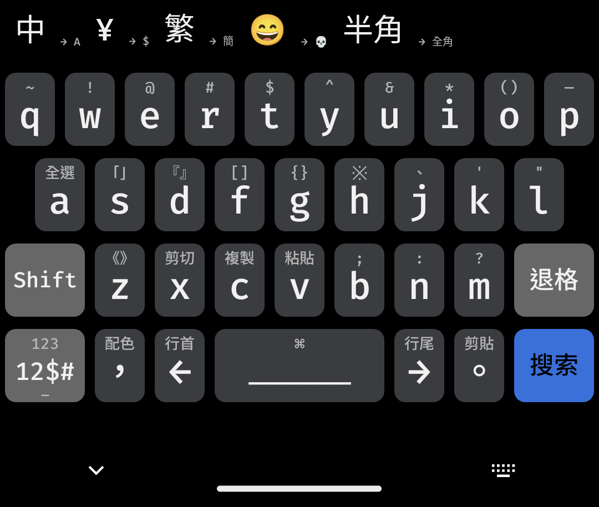
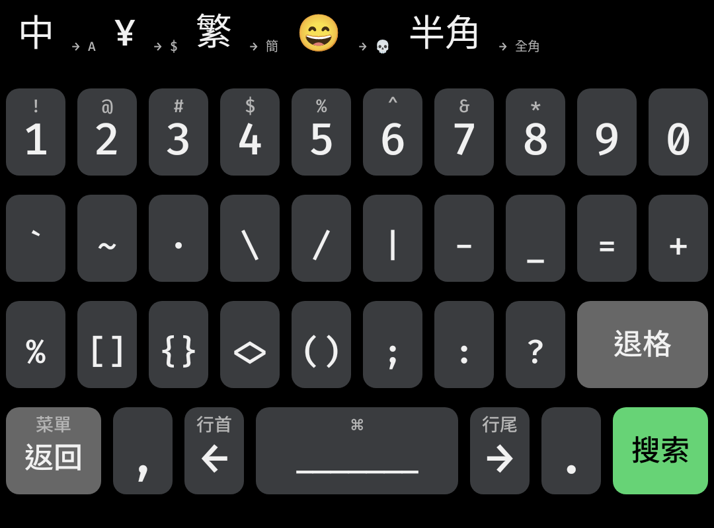
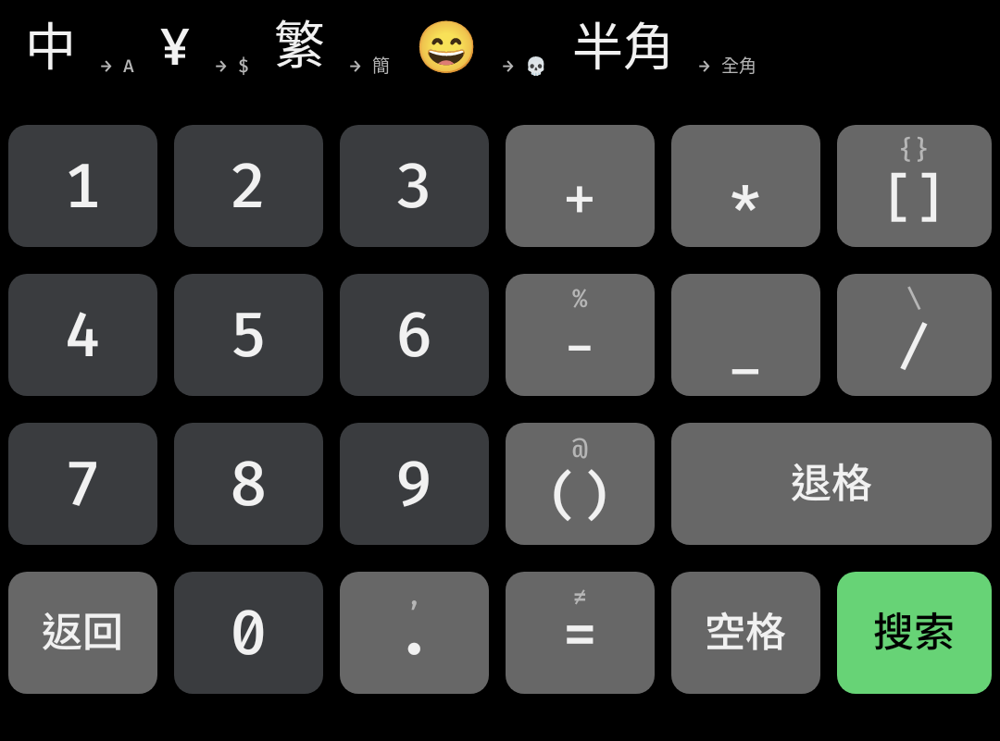
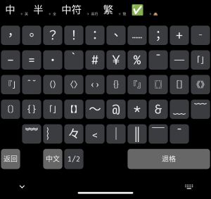
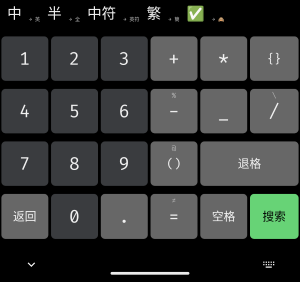

# Fira Theme
一個[同文輸入法](https://github.com/osfans/trime)主題，重新設計了佈局，刪除了大量鍵盤：Emoji、符號等，讓其更精簡。
- 鍵盤：主鍵盤、數字鍵盤、中文符號鍵盤
- 重新設計佈局，把大部分常用符號添加到主鍵盤的長按。
- 字體使用 Fira Code 和等距更紗黑體
  
# To-Do
- 添加更多配色
- 添加音效
- [x] 解決英文符號輸入的難題
  
# 如何安裝？
1. 在 [Releases](https://github.com/ChiesiMario/trime_fira_theme/releases) 中下載配置文件
2. 解壓到 Trime 的配置目錄首頁
3. 重啟 Trime 後選取 Fira 主題即可
   
但由於 Trime 的不穩定性，不能確保各個系統之間是否能順利使用，測試通過的 Trime 版本見 Releases 下的說明。

# 截圖

|  |  |
|:--:| :--:|
| Fira Dark | Fira Light |

|  |  |  |  |
|:--:| :--:| :--:| :--:|
